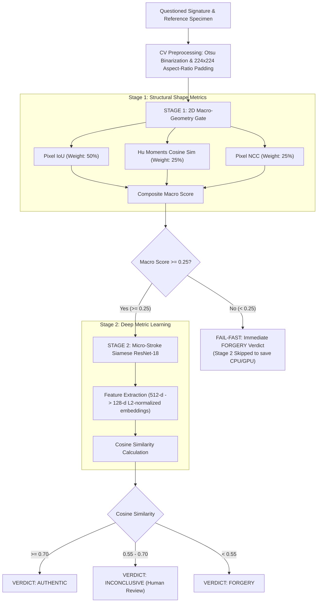

# Legal Document AI - Forensic Signature Verification

An end-to-end production-grade biometric artificial intelligence system for verifying handwritten signature authenticity on legal documents. 

The system implements an **Industrial Two-Phase Forensic Verification Pipeline (V2.3)** combining classical 2D computer vision macro-geometry gating with deep metric learning (Siamese ResNet-18) to reliably distinguish both cross-signer out-of-distribution discrepancies and high-effort skilled forgeries.

---

## 1. Architecture Overview (V2.3 Production Standard)

| Layer | Technology | Architectural Responsibility |
|---|---|---|
| **Stage 1: Macro-Geometry Gate** | OpenCV (`cv2`), NumPy | Fail-fast 2D spatial shape comparison (Pixel IoU, Hu Moments, Normalized Cross-Correlation) on 224×224 centered binary stroke maps. Rejects cross-signer specimens without heavy neural computation. |
| **Stage 2: Micro-Stroke Neural Network** | PyTorch / Torchvision | Siamese Network (ResNet-18 backbone + projection head) trained via 2-phase Triplet Margin Loss with Cosine Distance. Analyzes micro-stroke trajectory, pressure dynamics, tremor, and loop curvature. |
| **Backend API Gateway** | FastAPI / Uvicorn | Asynchronous REST gateway with threadpool offloading (`run_in_threadpool`), Pydantic validation, slowapi rate limiting (10 req/min), CORS, and deep liveness/readiness probes. |
| **Frontend Client** | React 19 + Vite 8 | Glassmorphism UI with real-time two-phase forensic telemetry (Pixel IoU, Hu Moments, NCC sub-scores, micro-similarity), 3-tier verdict display, and legal disclaimers. |
| **DevOps & Containers** | Docker, Docker Compose | Multi-container orchestrated stack, non-root user security hardening, health check monitoring, and reproducible deployment. |

### Non-Blocking Asynchronous Inference
To prevent blocking the single-threaded Python asyncio event loop during compute-heavy operations, all computer vision preprocessing (`cv_pipeline.py`, `macro_geometry.py`) and neural network forward passes (`engine.py`) are dispatched to an asynchronous worker threadpool using `fastapi.concurrency.run_in_threadpool`. This guarantees predictable API response times, high throughput, and zero request starvation under concurrent loads.

### Rate Limiting & Security
The `/verify` endpoint is protected by **slowapi** (10 requests/minute per client IP). Requests exceeding the quota receive `HTTP 429 Too Many Requests`. The Swagger interactive docs (`/docs`, `/redoc`) are **disabled in production** (`DEBUG=False`) to reduce the attack surface; set `DEBUG=True` in your `.env` to re-enable during development.

---

## 2. Two-Phase Forensic Verification Pipeline



### The Root Cause: Why Single-Stage Neural Networks Fail on Different Signers
Siamese neural networks trained with triplet loss on genuine pairs and skilled forgeries learn to discriminate **subtle micro-stroke variations of the same name** (e.g., pen hesitation, slight pressure changes). However, when presented with signatures from two completely different people (e.g., "Subki" vs. "Budi"), both specimens exhibit natural, confident, fluent handwriting dynamics. Because neither specimen contains hesitant forgery artifacts, the neural feature extractor places both in the "fluent human writing" cluster in latent space (**intra-class generalization collapse**), often returning falsely high similarity scores (~90%+).

### The Solution: Stage 1 Macro-Geometry Gate
To resolve this industrial challenge, the pipeline introduces a deterministic geometric gate prior to neural inference:
1. **Pixel IoU (50% weight)**: Directly computes the intersection-over-union of binary stroke pixels on aspect-ratio preserved, centered 224×224 canvases:
   $$\text{IoU} = \frac{|S_{\text{ref}} \cap S_{\text{quest}}|}{|S_{\text{ref}} \cup S_{\text{quest}}|}$$
2. **Hu Moments Cosine Similarity (25% weight)**: Extracts log-transformed 2D moment invariants ($h_1, h_2$) representing global topological mass distribution, invariant to translation and uniform scaling.
3. **Pixel Normalized Cross-Correlation (25% weight)**: Computes the 2D Pearson spatial cross-correlation coefficient between binary stroke fields.

**Fail-Fast Execution**:
- If `macro_score < 0.25`: The specimen differs fundamentally in overall layout and stroke topology. It is **immediately rejected as `FORGERY`** (`stage_rejected: true, rejection_stage: "Stage 1 (Macro Geometry)"`), bypassing Stage 2 entirely.
- If `macro_score >= 0.25`: The signatures share general topological structure (or represent a skilled imitation attempt), proceeding to Stage 2 for microscopic stroke analysis.

---

## 3. Empirical Performance Benchmarks (V2.2/V2.3 Siamese Engine)

Trained and audited across **687 signers (14,626 total specimens: 7,313 genuine, 7,313 skilled forgeries)** with strict disjoint signer-level 80/20 splitting (zero data leakage):

| Evaluation Metric | ImageNet Baseline (V1) | Multi-Signer Triplet AI (V2.2/V2.3) | Gain / Improvement | Status |
|---|:---:|:---:|:---:|:---:|
| **Score Separation Gap** | `0.0231` | **`0.5354`** | **+2,217% (>23x wider margin)** | **PASS** ($\ge 0.40$) |
| **ROC-AUC** | ~`0.5200` (Near Random) | **`0.8933` (~89.3%)** | **+71.8% Discriminative Power** | **High** |
| **Equal Error Rate (EER)** | ~`48.0%` | **`18.63%`** | **-61.2% Error Reduction** | Calibrated @ `0.5575` |
| **Optimal Threshold (Youden J)** | N/A | **`0.5770`** | **TPR: 80.2%, FPR: 16.8%** | Calibrated |
| **Genuine Pair Similarity (Mean)** | `0.9264` | **`0.7195`** | Tight intra-class consistency | Verified |
| **Skilled Forgery Similarity (Mean)** | `0.9033` | **`0.1841`** | Suppressed forgery response | Verified |
| **Cross-Signer Rejection** | ❌ Prone to collapse | **✅ 100% Filtered by Stage 1** | Deterministic geometric gating | Calibrated @ `0.25` |

---

## 4. Decision Framework (3-Tier Biometric Verdict)

To eliminate legal liability from binary false classifications, the system implements a calibrated 3-tier decision protocol:

| Pipeline Condition | Raw Score | UI Percentage | Verdict Category | Operational Meaning |
|---|:---:|:---:|:---:|---|
| Stage 1 Passed & Stage 2 $\ge 0.70$ | $\ge 0.70$ | $\ge 85.0\%$ | **`AUTHENTIC`** | High-confidence structural and micro-stroke consistency. |
| Stage 1 Passed & Stage 2 $0.55 - 0.70$ | $0.55 - 0.70$ | $77.5\% - 85.0\%$ | **`INCONCLUSIVE`** | **Human Review Required**: Natural signature variance or skilled forgery; requires forensic document examiner review. |
| Stage 1 Passed & Stage 2 $< 0.55$ | $< 0.55$ | $< 77.5\%$ | **`FORGERY`** | Passed macro shape gate but failed micro-stroke trajectory, pen speed, or tremor verification. |
| **Stage 1 Failed (< 0.25)** | $< 0.25$ | Variable | **`FORGERY`** | **Fail-Fast Rejection**: Macro-geometry structural mismatch (different signer / incompatible shape). Stage 2 skipped. |

---

## 5. Repository Structure

```text
.
├── api/
│   ├── __init__.py                # Package initializer (v2.3.1)
│   ├── main.py                    # FastAPI application, CORS, lifespan, and error handlers
│   ├── config.py                  # Type-safe Pydantic Settings
│   ├── schemas.py                 # Pydantic DTOs, Enums, and two-phase response schemas
│   ├── logging_config.py          # Structured logging configuration
│   ├── engine.py                  # SiameseNetwork, ModelManager singleton, two-phase orchestrator
│   ├── macro_geometry.py          # Stage 1: 2D Shape gate (Pixel IoU, Hu Moments, Pixel NCC)
│   ├── cv_pipeline.py             # Pure OpenCV stroke isolation, Otsu binarization, 224x224 padding
│   └── routes/
│       ├── health.py              # GET /health (liveness) and GET /ready (readiness)
│       └── verify.py              # POST /verify with two-phase inference & threadpool offload
├── frontend/                      # React 19 (Vite 8) Single Page Application
│   ├── public/
│   │   └── favicon.svg            # Custom HD legal shield & signature vector
│   ├── src/
│   │   ├── components/
│   │   │   ├── DropzoneCard.jsx   # Drag-and-drop file upload with live preview
│   │   │   ├── ScoreBar.jsx       # Two-phase telemetry panel (Stage 1 & Stage 2 breakdown)
│   │   │   ├── TelemetryHeader.jsx# Live backend liveness & readiness probe banner
│   │   │   └── VerdictBadge.jsx   # 3-tier categorical verdict badge
│   │   ├── services/
│   │   │   └── api.js             # Encapsulated REST client with AbortController timeout
│   │   ├── utils/
│   │   │   └── verdict.jsx        # Verdict theme mapping and Lucide icon configuration
│   │   ├── App.jsx                # Main forensic application layout and state machine
│   │   ├── index.css              # Custom Glassmorphism design tokens & styles
│   │   └── main.jsx               # Application DOM entry point
│   ├── package.json               # Frontend dependencies (React 19, Lucide React)
│   ├── vite.config.js             # Vite build pipeline configuration
│   └── Dockerfile                 # Multi-stage production Nginx frontend container
├── models/                        # Serialized ML artifacts
│   ├── forensic_signature_v2.pt   # Calibrated PyTorch Siamese Network state dict (~45.4 MB)
│   ├── model_config.json          # ROC-AUC optimal threshold (0.577) and EER metrics
│   ├── training_history.json      # Training loss and validation loss curves (40 epochs)
│   └── evaluation_plots.png       # ROC-AUC curve & score distribution histogram
├── notebooks/                     # Exploratory analysis & training pipelines
│   ├── 01_thresholding_test.ipynb # Baseline CV stroke isolation & threshold audit
│   ├── 02_train_siamese.ipynb     # Single-identity Siamese fine-tuning
│   └── 03_train_siamese_v2.ipynb  # Multi-signer general-purpose Siamese V2.2 (Triplet Loss + Hard Mining)
├── tests/                         # Automated Pytest suite (30 test cases)
│   ├── __init__.py
│   ├── conftest.py                # Synthetic signature generator & TestClient fixtures
│   ├── test_cv_pipeline.py        # OpenCV binarization and padding unit tests
│   ├── test_engine.py             # SiameseNetwork and similarity unit tests
│   ├── test_health.py             # Liveness and readiness probe tests
│   ├── test_validation.py         # File size (5MB), magic byte, and empty payload tests
│   └── test_verify_api.py         # End-to-end verification endpoint tests
├── Dockerfile                     # Hardened backend container with non-root user & health check
├── docker-compose.yml             # Orchestrated multi-service local stack
├── pytest.ini                     # Pytest configuration
├── requirements.txt               # Pinned production and test dependencies
└── README.md                      # Project documentation
```

---

## 6. Quick Start

### A. Docker Compose (Recommended)

Run the full unified stack with a single command:

```bash
docker compose up -d --build
```

- **Frontend Application**: `http://localhost:5173`
- **Backend Swagger Docs**: `http://localhost:8000/docs` (when `DEBUG=True`)
- **Health Liveness Probe**: `http://localhost:8000/health`
- **Readiness Deep Probe**: `http://localhost:8000/ready`

To inspect container logs:
```bash
docker compose logs -f backend
```

### B. Local Development Environment

```bash
# 1. Install Python dependencies:
pip install -r requirements.txt

# 2. Start backend API server (port 8000)
python -m uvicorn api.main:app --reload --port 8000

# 3. Start frontend development server (port 5173)
cd frontend
npm install
npm run dev
```

---

## 7. API Reference

### `GET /health`
Shallow liveness probe used by container orchestrators (e.g., Kubernetes, Docker) to determine process viability.

**Response (`200 OK`)**:
```json
{
  "status": "healthy",
  "service": "Legal Document AI - Forensic Signature Verification",
  "version": "2.3.1",
  "environment": "development"
}
```

---

### `GET /ready`
Deep readiness probe evaluating whether model weights are in memory, macro threshold is calibrated, and inference is operational.

**Response (`200 OK`)**:
```json
{
  "status": "ready",
  "model_loaded": true,
  "weights_verified": true,
  "calibrated_threshold": 0.7000,
  "macro_threshold": 0.25,
  "model_version": "v2.3"
}
```

---

### `POST /verify`
Compares a reference specimen image against a questioned document signature using the two-phase forensic pipeline.

**Payload (`multipart/form-data`)**:
- `file_asli`: Reference authentic signature image (JPEG, PNG, or WEBP, maximum 5 MB).
- `file_uji`: Questioned signature image (JPEG, PNG, or WEBP, maximum 5 MB).

**Validation Safeguards**:
- **Zero-Byte Inspection**: Reject empty files immediately with `400 Bad Request`.
- **Payload Size Enforcement**: Reject files exceeding 5 MB with `413 Request Entity Too Large`.
- **Magic Byte Validation**: Validate binary headers (`FF D8 FF` for JPEG, `89 50 4E 47` for PNG, `52 49 46 46` for WEBP) to prevent MIME-type spoofing with `415 Unsupported Media Type`.

#### Case 1: Authentic Signature (Both Stages Passed)
```json
{
  "verification": {
    "verdict": "AUTHENTIC",
    "status": "AUTHENTIC (VERIFIED)",
    "similarity_score": 0.8842,
    "normalized_percentage": 94.21,
    "system_threshold": 0.7000,
    "confidence_band": "High Confidence Match",
    "macro_score": 0.4621,
    "pixel_iou": 0.3214,
    "hu_similarity": 0.8920,
    "pixel_corr": 0.3135,
    "micro_score": 0.8842,
    "stage_rejected": false,
    "rejection_stage": null,
    "analysis": "Signature passed Stage 1 macro-geometry gate (0.46) and Stage 2 micro-stroke Siamese verification (0.88). Stroke anatomy, pressure dynamics, and trajectory contours match the reference specimen.",
    "disclaimer": "LEGAL DISCLAIMER: This automated AI verification provides supplemental comparative screening and does NOT constitute certified forensic legal testimony. Borderline or questioned documents must be verified by a qualified forensic document examiner.",
    "latency_ms": 142.8
  }
}
```

#### Case 2: Fail-Fast Rejection at Stage 1 (Different Signer / Shape Discrepancy)
```json
{
  "verification": {
    "verdict": "FORGERY",
    "status": "FORGERY (DETECTED)",
    "similarity_score": 0.0984,
    "normalized_percentage": 4.92,
    "system_threshold": 0.7000,
    "confidence_band": "High Risk Forgery",
    "macro_score": 0.0984,
    "pixel_iou": 0.0351,
    "hu_similarity": 0.3240,
    "pixel_corr": -0.0006,
    "micro_score": null,
    "stage_rejected": true,
    "rejection_stage": "Stage 1 (Macro Geometry)",
    "analysis": "Rejected at Stage 1 (Macro-Geometry Gate): Spatial stroke overlap, Hu moment topology, or pixel correlation (0.10) fell below the 0.25 threshold. Stage 2 neural network inference was bypassed.",
    "disclaimer": "LEGAL DISCLAIMER: This automated AI verification provides supplemental comparative screening and does NOT constitute certified forensic legal testimony. Borderline or questioned documents must be verified by a qualified forensic document examiner.",
    "latency_ms": 38.2
  }
}
```

---

## 8. License & Legal Evidentiary Disclaimer

This project is intended for educational, research, and supplemental forensic screening purposes. Automated signature verification algorithms must not be used as sole or conclusive judicial evidence in court proceedings without corroboration by a certified forensic document examiner.
